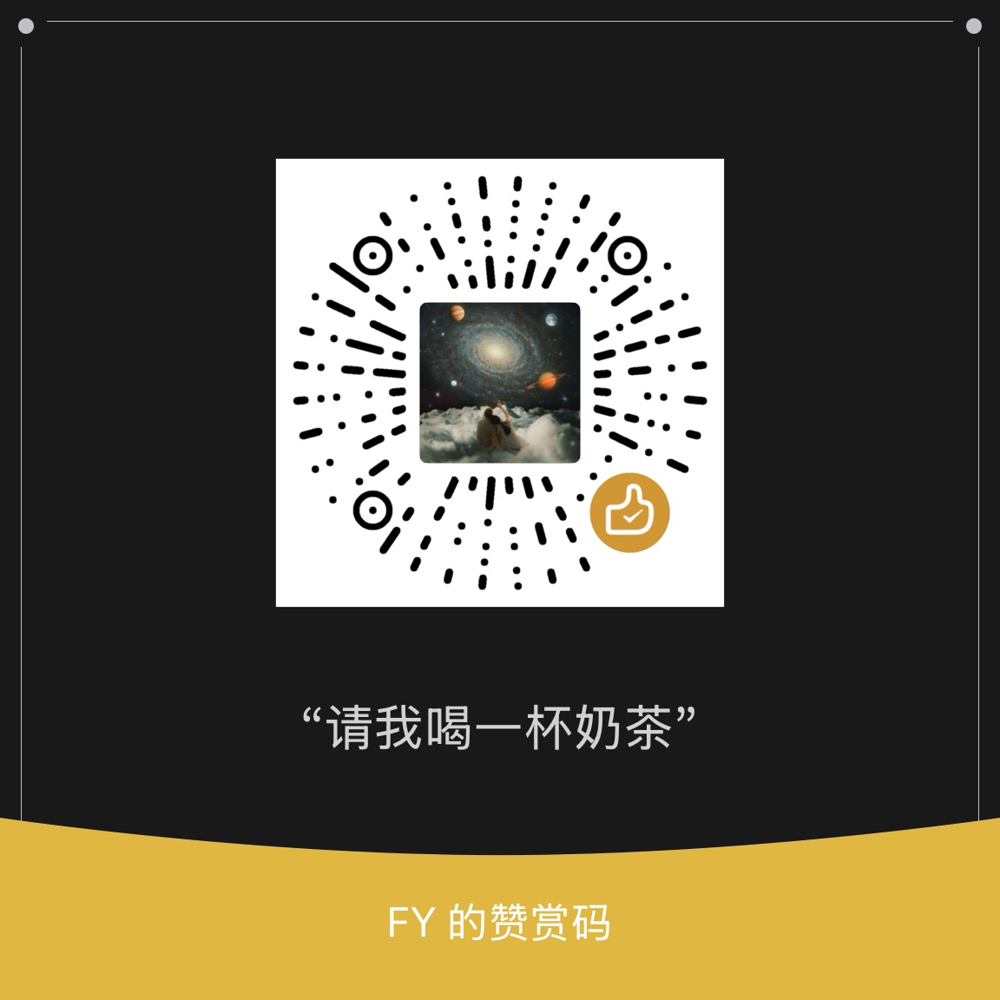

<p align="center">
    
    <h1 align="center">Cloud Mail Plus</h1>
    <p align="center">Enhanced Cloudflare Workers Email Service — Native Cloudflare Email Service Sending + External API + D1 Auto Backup</p>
    <p align="center">
        Simplified Chinese | <a href="/README-en.md">English</a>
    </p>
    <p align="center">
        <a href="https://github.com/AndrewYukon/cloud-mail-plus/blob/main/LICENSE">
            
        </a>
    </p>
</p>

## Credits

This project is developed based on [maillab/cloud-mail](https://github.com/maillab/cloud-mail), adding the following features to its excellent Cloudflare Workers email service. Thanks to the original author for the open-source contribution.

## New Features

### 1. Cloudflare Email Service Integration

Uses Cloudflare's native `send_email` Workers binding to send emails, replacing Resend as the primary sending method.

- **CF Priority Mode** (default): Sends via Cloudflare Email Service first, automatically falls back to Resend on failure
- **Resend Only Mode**: Behaves identically to the original version
- **CF Only Mode**: Uses Cloudflare exclusively, with no fallback

Advantages:
- No third-party API key required (Cloudflare automatically manages SPF/DKIM/DMARC)
- Better sender reputation (uses Cloudflare IPs instead of self-hosted server IPs)
- Zero additional cost (included in Workers paid plans)

Switch in the admin dashboard under **Settings → Email Sending Method**.

### 2. External API (External Sending API)

Allows other applications to send emails and query statuses via HTTP API, supporting all configured domains.

```bash
# Send email
curl -X POST "https://your-domain.com/api/external/send" \
  -H "Content-Type: application/json" \
  -H "X-API-Key: YOUR_API_KEY" \
  -d '{
    "from": "App <noreply@example.com>",
    "to": "user@gmail.com",
    "subject": "Hello",
    "html": "<p>Hello world</p>"
  }'

# Query status
curl "https://your-domain.com/api/external/status/9" \
  -H "X-API-Key: YOUR_API_KEY"
```

API Keys are generated in the admin dashboard under **Settings → External API Keys**.

Detailed documentation: [External API Guide](docs/external-api-guide.md)

### 3. Email Deletion + R2 Attachment Cleanup (Web UI + API)

**Web UI**: The toolbar shows two delete buttons when emails are selected:
- 🗑️ Soft Delete — Marks as deleted, recoverable
- 🗑️ **Permanent Delete** — Deletes the email + R2/S3/KV attachments + favorites, irreversible (includes a confirmation dialog)

The **External API** also provides deletion endpoints:

```bash
# Soft delete (marks as deleted, recoverable)
curl -X DELETE "https://your-domain.com/api/external/email/123" -H "X-API-Key: KEY"

# Permanent delete (deletes email + R2 attachments + favorites)
curl -X DELETE "https://your-domain.com/api/external/email/123/permanent" -H "X-API-Key: KEY"

# Batch delete
curl -X POST "https://your-domain.com/api/external/email/batch-delete" \
  -H "X-API-Key: KEY" -H "Content-Type: application/json" \
  -d '{"emailIds":[1,2,3],"permanent":true}'
```

### 4. Export Emails as .eml Files (Web UI + API)

Supports exporting emails to standard `.eml` format (RFC 5322), which can be opened in any email client like Outlook or Thunderbird.

**Web UI**: Open email details → Click the download icon 📥 → Automatically downloads the `.eml` file.

**External API**:
```bash
curl "https://your-domain.com/api/external/email/9/export" \
  -H "X-API-Key: KEY" -o email-9.eml
```

Exported content includes: Email headers (From/To/Subject/Date), HTML + plain text body, inline images (CID), and attachments.

### 5. New User Registration Notification

Automatically sends a notification to the Telegram Bot and admin email (via CF Email Service) when a new user registers. No additional configuration required — uses existing Telegram Bot settings.

### 5. Admin Password Reset

Reset admin password via JWT Secret if forgotten:

```bash
curl -X POST "https://your-domain.com/api/reset-admin/<jwt_secret>" \
  -H "Content-Type: application/json" \
  -d '{"password":"newpassword"}'
```

### 7. D1 Auto Backup to R2

Built-in cron scheduled task in the Worker automatically exports full D1 data as SQL, compresses it with gzip, and uploads to R2 daily.

- Runs automatically daily at 02:00 UTC
- Keeps the most recent 30 backups, automatically cleans up old ones
- Zero external dependencies — completely handled within Cloudflare
- Supports manual trigger: `POST /api/backup/<jwt_secret>`
- View backup list: `GET /api/backup/<jwt_secret>/list`

### 8. AI Email Assistant (Cloudflare Workers AI)

Integrates a conversational email assistant using [Cloudflare Workers AI](https://developers.cloudflare.com/workers-ai/) (`@cf/moonshotai/kimi-k2.5`). After logging in, click the **✨ Email Assistant** button in the Header to open a sidebar and chat with the AI.

**9 Email Tools** (automatically selected/called by AI):

| Tool | Purpose | Requires Confirmation |
|------|------|----------|
| `listEmails` | List Inbox / Sent / Drafts / Spam | No |
| `searchEmails` | Search emails by subject/sender/date | No |
| `getEmail` | Read full text of a specific email + attachment list | No |
| `getAttachmentText` | Read text-based attachments (text/* / json / xml / csv) | No |
| `summarizeEmail` | 3-5 line key summary + action items | No |
| `draftReply` | Draft a reply (saved to Drafts) | No |
| `draftNew` | Draft a new email | No |
| `sendDraft` | Send draft | **Yes ✓** |
| `deleteEmail` | Delete email (soft/permanent) | **Yes ✓** |

**Auto-draft Reply for New Emails** — When a new email arrives, the AI automatically reads it and generates a reply draft saved to Drafts (**never auto-sends**, requires user confirmation in the UI).

**Security Features**:
- Send and delete operations must be executed by the user clicking "Confirm" in the confirmation card at the bottom of the sidebar
- All tool calls are isolated per user — one user's AI assistant never sees another user's emails
- Tool call count is capped (max 8 steps per conversation) to prevent cost spikes
- Auto-drafting is limited to 2 steps (read + draft)
- Automatically skips emails the AI model determines don't require a reply (noreply / spam / automated notifications)

**Configuration**: Log in → Go to **Settings** → Scroll to the bottom **✨ AI Email Assistant** section → Enable the "AI Assistant" toggle + optional "Auto-draft" + custom persona instructions.

**Model & Billing**: Uses Cloudflare Workers AI Kimi K2.5. Free tier gets 10,000 neurons per day; a single conversation consumes ~50-200 neurons, sufficient for normal usage.

**Integration Stack**: [AI SDK v6](https://sdk.vercel.ai/) + `@ai-sdk/vue` v3 (`Chat` class) + `workers-ai-provider` + Cloudflare Workers AI. Full Chinese/English i18n.

---

## Deployment

### Prerequisites

- [Cloudflare](https://dash.cloudflare.com) account
- [Node.js](https://nodejs.org/) 16.17+
- [pnpm](https://pnpm.io/) 8+ (recommended) or npm
- `jq`, `python3`, `openssl`, `curl` (required for the one-click script)
- Domain already added to Cloudflare DNS

### One-Click Deployment (Recommended)

```bash
git clone https://github.com/AndrewYukon/cloud-mail-plus.git
cd cloud-mail-plus
bash scripts/deploy.sh
```

The script will automatically:
- Check wrangler login status (triggers `wrangler login` if not logged in)
- Idempotently create D1 / KV / R2 (reuses existing ones, never duplicates)
- Generate a 64-character JWT secret
- **Optionally enable AI Email Agent** (Workers AI kimi-k2.5 + auto-drafting) — automatically writes `[ai]` binding, `EmailAgent` Durable Object, DO migration, and agent schema
- Writes bindings + vars within the marked blocks in `wrangler.toml` (re-runs replace without duplicating)
- `wrangler deploy` (automatically builds Vue frontend)
- Calls `/api/init/<jwt_secret>` to initialize D1 schema (including agent tables)
- Saves state to `.cloud-mail-deploy.env` (gitignored, contains JWT secret)

**Subcommands:**

```bash
bash scripts/deploy.sh                  # Interactive first deployment (prompts to enable AI Agent)
bash scripts/deploy.sh --with-ai        # Automatically enable AI Email Agent (non-interactive)
bash scripts/deploy.sh --no-ai          # Automatically disable AI Email Agent (non-interactive)
bash scripts/deploy.sh --redeploy       # Rebuild + deploy only, skip resource creation
bash scripts/deploy.sh --reset          # Clear local state file, start over
bash scripts/deploy.sh --destroy        # Dismantle Worker + D1 + KV + R2 (irreversible)
bash scripts/deploy.sh --destroy --yes  # Skip confirmation (CI/automation)
```

> `--destroy` permanently deletes email data, attachments, and backups. Use with caution; it's recommended to back up important data via `wrangler r2 object` first.

**One-Click Enable AI Email Agent:**

```bash
bash scripts/deploy.sh --with-ai
```

After deployment:
1. Log in to the Web UI (first-time requires registering an admin account — email must match `admin` in `wrangler.toml`)
2. A yellow capsule button **✨ Email Agent** appears in the top Header
3. The bottom of the **Settings** page contains the **✨ AI Email Assistant** section — toggle "Enable AI Assistant" + optional "Auto-draft" + custom persona
4. Click the Header button → Sidebar slides out → Chat with AI

Features included after enabling:
- **9 Email Tools**: listEmails / searchEmails / getEmail / getAttachmentText / summarizeEmail / draftReply / draftNew / sendDraft / deleteEmail
- **Send + Delete require double confirmation** (confirmation card pops up at the bottom of the sidebar, never auto-executes)
- **Auto-drafts replies for new emails** (saved to Drafts, never auto-sends)
- **Full Chinese/English i18n** (follows system language)
- **Model**: `@cf/moonshotai/kimi-k2.5` (Cloudflare Workers AI, billed per neuron, free tier gets 10,000 neurons/day)

> **Integration Architecture**: AI SDK v6 (`ai` package) + `@ai-sdk/vue` v3 (`Chat` class) + `workers-ai-provider` + Cloudflare Workers AI. Worker routes directly call `streamText()` to stream responses via SSE (avoids using Durable Objects to prevent protocol mismatch issues between AIChatAgent and Vue Chat's WebSocket/HTTP).

### Known Deployment Notes

- **`pnpm install`** — If worker dependencies are not installed on first deployment, errors like `Could not resolve "workers-ai-provider"` may occur. The script auto-detects and installs them, but the first run will be slower.
- **`compatibility_flags = ["nodejs_compat"]`** — Must be enabled (agent dependencies use `node:async_hooks` / `node:diagnostics_channel`). Automatically written by the one-click script.
- **`/api/init/<jwt_secret>`** is a **GET** request, not POST.
- **Turnstile** — By default, if `site_key` is not configured, it will throw "Verification module failed to load". If encountered after one-click deployment, run:
  ```bash
  npx wrangler d1 execute cloud-mail --remote --command "UPDATE setting SET site_key='', secret_key='';"
  ```
  Then hard refresh the browser (Cmd+Shift+R) to disable the captcha.
- **PWA Cache** — After redeployment, the Service Worker may still serve the old version. DevTools → Application → Service Workers → Unregister, then hard refresh.

### Manual Deployment (Step-by-Step)

If you need finer control (e.g., custom domains, sharing an existing D1), you can follow these manual steps.

1. **Clone the repository**

```bash
git clone https://github.com/AndrewYukon/cloud-mail-plus.git
cd cloud-mail-plus
```

2. **Create Cloudflare Resources**

```bash
cd mail-worker
wrangler d1 create cloud-mail
wrangler kv namespace create cloud-mail-kv
wrangler r2 bucket create cloud-mail-r2
```

3. **Configure `wrangler.toml`**

Fill in the IDs generated in the previous step into `wrangler.toml`:

```toml
[[d1_databases]]
binding = "db"
database_name = "cloud-mail"
database_id = "<your-d1-id>"

[[kv_namespaces]]
binding = "kv"
id = "<your-kv-id>"

[[r2_buckets]]
binding = "r2"
bucket_name = "cloud-mail-r2"

[vars]
domain = '["example.com"]'
admin = "admin@example.com"
jwt_secret = "<random-string>"
```

4. **Enable Cloudflare Email Service (Optional)**

Onboard your domain in Cloudflare Dashboard → Email → Email Sending, then uncomment in `wrangler.toml`:

```toml
[[send_email]]
name = "EMAIL"
```

5. **Deploy**

```bash
wrangler deploy
```

6. **Initialize Database**

```
https://your-worker.workers.dev/api/init/<your-jwt-secret>
```

7. **Register Admin Account**

Visit your Worker URL and register using the email from the `admin` config.

---

## CF Email Service API Notes

API details discovered during Cloudflare Email Service integration (not fully documented):

| Item | Description |
|------|------|
| `from` field | Must be a `{ name, email }` object, cannot use `"Name <email>"` string format |
| Attachment `type` field | MIME type field name is `type`, not `mimeType` or `contentType` |
| Attachment `disposition` | **Required**, value must be `"attachment"` or `"inline"` |
| Sending status | Synchronously returns success/failure, no webhook callback (unlike Resend) |
| Recipient limit | to + cc + bcc total must not exceed 50 |

---

## FAQ

### Subdomain Catch-All Email Routing (Main domain bound to another email service)

If your main domain (e.g., `example.com`) is already bound to another email service (e.g., Google Workspace) and you cannot enable Email Routing on Cloudflare, you can use a subdomain:

1. Enable Email Routing for the subdomain `mail.example.com` in the Cloudflare Dashboard
2. Set catch-all → cloud-mail Worker
3. Add `"mail.example.com"` to the `domain` array in `wrangler.toml`
4. User email format becomes `user@mail.example.com`

Note: Email Routing for subdomains and main domains are independent and do not affect each other.

### IMAP/POP3/SMTP Client Support (Outlook/Thunderbird)

Cloudflare Workers cannot run TCP protocol services like IMAP/SMTP. To send/receive emails in clients like Outlook, we recommend pairing with [Stalwart Mail Server](https://github.com/stalwartlabs/stalwart):

- Deployment guide: [stalwart-mail-deploy](https://github.com/AndrewYukon/stalwart-mail-deploy)
- Stalwart provides IMAP (993) + SMTP (465) for Outlook
- Cloud-Mail Plus provides sending via External API (routes through CF Email Service for higher reputation)
- Both can be integrated via the Mail Bridge component (see [Cloudflare Workers strategy](https://github.com/AndrewYukon/stalwart-mail-deploy/tree/main/outbound-strategies/cloudflare-workers) in stalwart-mail-deploy)

---

## Original Features

This project retains all original features from [maillab/cloud-mail](https://github.com/maillab/cloud-mail):

- Multi-domain support
- Email sending/receiving (Cloudflare Email Routing for receiving + Resend for sending)
- Attachment support (R2/S3/KV storage)
- Responsive Web UI (Vue 3 + Element Plus)
- Multi-user + RBAC permission control
- Telegram push notifications
- Turnstile captcha
- Email forwarding
- Dark mode
- Multi-language (CN/EN)

---

## Tech Stack

| Component | Technology |
|------|------|
| Runtime | Cloudflare Workers |
| Backend Framework | Hono.js |
| Database | Cloudflare D1 (SQLite) + Drizzle ORM |
| Cache | Cloudflare KV |
| File Storage | Cloudflare R2 |
| Sending | **Cloudflare Email Service** (primary) + Resend (fallback) |
| Receiving | Cloudflare Email Routing |
| Frontend | Vue 3 + Element Plus + Vite |

---

## Support the Project

If this project is helpful to you, feel free to buy me a coffee ☕



---

## License

MIT — Consistent with the original project. See [LICENSE](LICENSE) for details.
